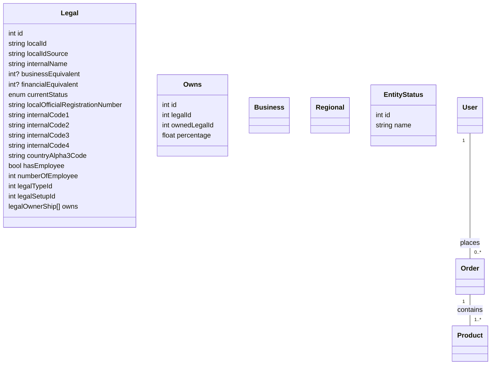

# Documentation - classes

```mermaid
classDiagram
    class Legal {
        int id
        string localId
        string localIdSource
        string internalName
        %% foreign id to Business Entity
        int? businessEquivalent
        %% foreign id to Finance Entity
        int? financialEquivalent
        enum currentStatus
        %% datetime currentOfficialLegalNameValidFrom
        %% datetime currentOfficialLegalNameValidTo
        %% datetime upcomingOfficialLegalNameValidFrom
        %% explain pleas (local = company domain, perhaps national?)
        string localOfficialRegistrationNumber
        %% explain please:
        string internalCode1
        string internalCode2
        string internalCode3
        string internalCode4
        %% foreign id to Countries
        string countryAlpha3Code
        bool hasEmployee
        int numberOfEmployee
        %% foreign id ("enum") to lookup table legalType
        int legalTypeId
        int legalSetupId
        legalOwnerShip[] owns
    }
    class Owns {
        int id
        int legalId
        int ownedLegalId
        float percentage
    }
    class Business {

    }
    class Regional {

    }
    class EntityStatus {
        int id
        %% enum: Archived, Published, Draft
        string name
    }
    User "1" -- "0..*" Order : places
    Order "1" -- "1..*" Product : contains
```